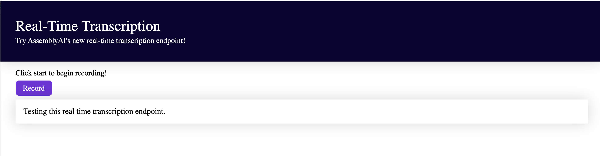

# AssemblyAI Real-Time Transcription Browser Example

## Description

This open-source repo provided by AssemblyAI displays how to use our real-time API in the browser!

In this app, we grab an audio stream from the user's computer and then send that to AssemblyAI for real-time transcription. Once AssemblyAI begins transcribing, we display the text in the browser. This is accomplished using Express for our backend and Vanilla JavaScript with the npm package [recordrtc](https://www.npmjs.com/package/recordrtc) for our frontend.

Your final app should look like this:

## How To Install and Run the Project

##### ❗Important❗

- Before running this app, you need to upgrade your AssemblyAI account. The real-time API is only available to upgraded accounts at this time.
- Running the app before upgrading will cause an **error with a 402 status code.** ⚠️
- To upgrade your account you need to add a card. You can do that in your dashboard [here](https://app.assemblyai.com/)!

##### Instructions

1. Clone the repo to you local machine.
2. Open a terminal in the main directory housing the project. In this case `assembly-ai-realtime-browsertest`.
3. Run `npm install` to ensure all dependencies are installed.
4. Add your AssemblyAI key to line 13 of `server.js` (in the `js` folder).
5. Start the server with the command `npm run server` (will run on port 5000).
6. Open a second terminal in the main directory of the project and start the client side with `npm run client` (will run on port 3000).
7. Go to http://localhost:3000. If you click "Record" nothing actually happens. Your task is to use the AssemblyAI API to record the user's microphone and then display a real-time transcript under this button once a user starts talking.

## Further Documentation

- [AssemblyAI Real-Time Documention](https://docs.assemblyai.com/overview/real-time-transcription)
- [recordrtc](https://www.npmjs.com/package/recordrtc)
- [Express](https://expressjs.com/)
